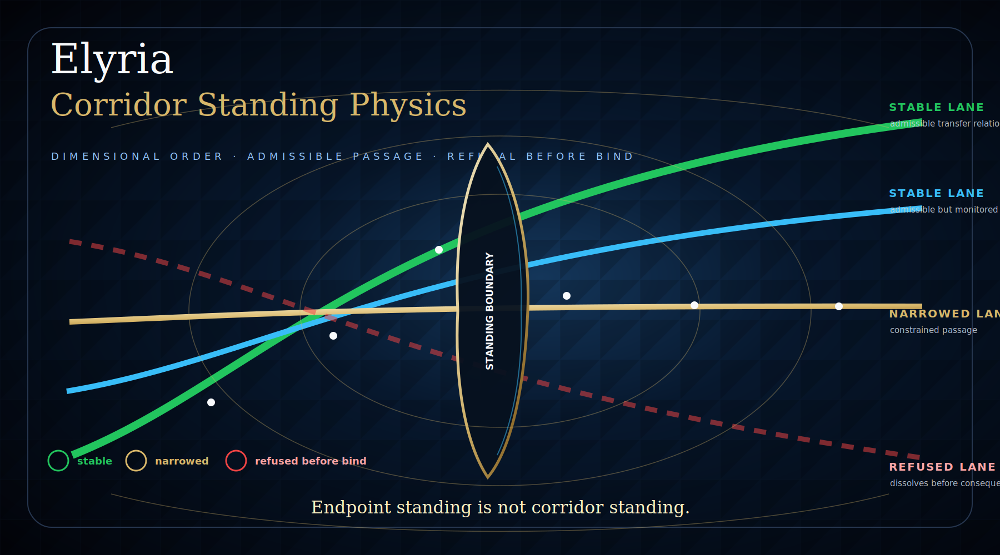

# Elyria Corridor Standing Physics


[](https://github.com/Kamanaka5502/elyria-corridor-standing-physics/actions/workflows/proof.yml)

Built by **Elyria Systems — VA**.

Copyright (c) 2026 **Samantha Revita** and **Terry Snyder**. All rights reserved.

This repository is a **protected public proof surface**. It is **not open source**.



## Core Rule

A corridor is not safe because endpoints are valid.

A corridor is safe only if the transfer relation has standing.

## What this is

Elyria Corridor Standing Physics formalizes high-consequence transfer corridors as lawful standing relations, not tunnels, shortcuts, or routing paths.

The public proof surface evaluates whether a corridor can form, transfer, close, and produce any downstream consequence while preserving standing across:

```text
source boundary
destination boundary
transfer relation
ramp lawfulity
radius / field stability
phase / coherence
transfer continuity
causal admissibility
debt bounds
authority ordering
non-singular closure
receipt / replay
```

## Runnable public proof

The first admitted public proof is a synthetic financial settlement corridor.

It demonstrates that valid source and destination boundaries do not admit transfer when the transfer relation and closure standing are degraded.

Run:

```bash
python CORRIDOR_STANDING_ENGINE.py
python test_corridor_standing.py
```

Expected decision:

```text
REFUSE_NARROW_QUARANTINE_ESCALATE_REBOUND
```

See:

```text
RUN_PROOF.md
REVIEWER_BRIEF.md
CORRIDOR_STANDING_LAW.md
SCENARIO_INDEX.md
```

## Compression

```text
Endpoint standing is not corridor standing.
Activation standing is not closure standing.
Transfer is not admissible unless the relation itself has standing.
```

## Public-Safe Formula

```text
CorridorStanding_AB =
  Standing(Mouth_A)
  AND Standing(Mouth_B)
  AND TransferRelationStanding_AB
  AND RampLawful
  AND StabilityBounded
  AND PhaseLocked
  AND TransferContinuous
  AND CausallyAdmissible
  AND DebtBounded
  AND AuthorityValid
  AND ClosureStanding
```

If the standing relation holds:

```text
FORM / TRANSFER / CLOSE / HARVEST / SETTLE
```

If the standing relation fails:

```text
PAUSE / NARROW / QUARANTINE / ESCALATE / REFUSE / HALT / TERMINATE / REBOUND
```

## Initial public lanes

This repository begins with operational corridors before extreme-field corridors:

```text
financial_settlement_corridor
regulated_data_transfer_corridor
ai_action_corridor
energy_transfer_corridor
```

Extreme-field transfer may be treated later as a protected future lane:

```text
extreme_field_transfer_corridor
```

## Non-reduction rule

This repository must not be reduced to:

```text
routing
workflow orchestration
network tunneling
risk scoring
policy checklist
post-event monitoring
dashboard governance
```

Those are lower-dimensional surfaces.

Corridor Standing Physics asks whether the **relation of transfer** can lawfully carry consequence.

## Protection boundary

This public repository intentionally excludes:

```text
private law bundles
protected mathematical substrate
extreme-field substrate internals
production admissibility compiler
customer-specific evidence envelopes
NDA-bound formal proofs
deployment-sensitive architecture
commercial pilot terms
internal Elyria Systems — VA architecture
private Veritas Aegis lineage materials
```

## Category statement

Elyria Corridor Standing Physics is a protected proof surface for high-consequence transfer relations. It determines whether movement between valid endpoints still has standing as a corridor before effect becomes irreversible.

**Warp is not speed. Warp is lawful corridor formation under standing.**
